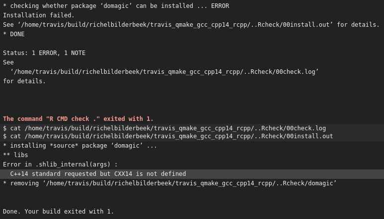

# travis_qmake_gcc_cpp14_rcpp

This build fails due to R its (current) lack of support of C++14.

This GitHub is part of 

 * [the Travis C++ Tutorial](https://github.com/richelbilderbeek/travis_cpp_tutorial)
 * [the Travis R Tutorial](https://github.com/richelbilderbeek/travis_r_tutorial)

The goal of this project is to have a clean Travis CI build, with specs:
 * Build system: `qmake`
 * C++ compiler: `gcc`
 * C++ version: `C++14`
 * Libraries: `STL` and `Rcpp`
 * Code coverage: none
 * Source: one single file, `main.cpp`

Less complex builds:
 * C++98: [travis_qmake_gcc_cpp98_rcpp](https://www.github.com/richelbilderbeek/travis_qmake_gcc_cpp98_rcpp)
 * C++11: [travis_qmake_gcc_cpp11_rcpp](https://www.github.com/richelbilderbeek/travis_qmake_gcc_cpp11_rcpp)
 * STL only: [travis_qmake_gcc_cpp11](https://www.github.com/richelbilderbeek/travis_qmake_gcc_cpp11)
